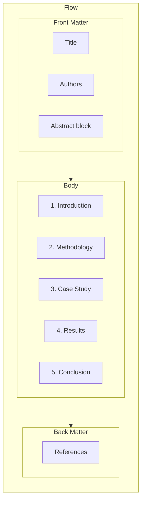

# Rewrite Plan: AIPV 2026 Extended Abstract

## Problem Analysis

The current [aipv2026_extended_abstract.tex](pgg-smc/notes/aipv2026_extended_abstract.tex) fails as an extended abstract because:

1. **Genre mismatch**: Reads like a narrative essay/blog post with `\paragraph{}` headers instead of academic sections
2. **Missing standard elements**: No `\begin{abstract}` block (standalone summary before main body); workshop proceedings typically require one
3. **No explicit contribution statement**: The review ([review-aipv2026_extended_abstract-20260314-224502.md](pgg-smc/notes/review-aipv2026_extended_abstract-20260314-224502.md)) explicitly notes this as a structural deficit
4. **Non-standard structure**: Uses "The timeline problem" / "The inverted workflow" instead of Introduction, Methodology, Results, Conclusion
5. **Flow issues**: Related work is inserted mid-document; Observations and Broader Implication blur together; no clear conclusion

## Target Structure (Standard Extended Abstract)

Extended abstracts for workshops typically follow a condensed IMRaD format:

## Rewrite Plan

### Phase 1: Add Required Front Matter

- **Add `\begin{abstract}...\end{abstract}`** (100–150 words):
  - Problem: formalization traditionally comes last; high barrier
  - Approach: invert workflow — formalize first as prototyping medium
  - Method: LLM drafts, type checker validates, human steers
  - Contribution: 42-file Rocq formalization of SMC-PGG; five domains learned through formalization
  - Result: 0 Admitted; workflow validated
- **Optional**: Add `\keywords{}` if venue allows (e.g., formalization, LLM-assisted proving, MPC, Rocq)

### Phase 2: Restructure Body with Section Headers

Replace `\paragraph{}` with `\section{}` and `\subsection{}`:

| Current               | Proposed                                         |
| --------------------- | ------------------------------------------------ |
| (no abstract)         | **Abstract**                                     |
| The timeline problem  | **1. Introduction**                              |
| The inverted workflow | **2. The Inverted Workflow** (subsection: Roles) |
| Case study: SMC-PGG   | **3. Case Study: SMC-PGG**                       |
| Observations          | **4. Observations**                              |
| Related work          | **5. Related Work**                              |
| Broader implication   | **6. Conclusion**                                |

### Phase 3: Introduction Rewrite

- **Paragraph 1**: Motivation — formalization-as-last-step barrier; what if formalization comes first?
- **Paragraph 2**: Contribution statement (explicit):
  - (a) Inverted workflow methodology: idea → formalize → learn
  - (b) 42-file Rocq formalization of SMC-PGG (covering-space MPC)
  - (c) Empirical observations on human/LLM/type-checker roles
- **Paragraph 3**: Roadmap — "The rest of this abstract is structured as follows..."

### Phase 4: Case Study Reorganization

- Keep the four-layer structure (protocol, search-space, reconstruction, security) but:
  - Use **subsections** (3.1–3.4) instead of inline emphasis
  - Add one-sentence parenthetical for undefined symbols (ε, T, N) when first used
  - Ensure "total variation distance" (not "information distance") — already fixed per review
  - Add one concrete example of "learned through formalization" (e.g., Cartier-Foata introduced by LLM for trace-counting)

### Phase 5: Related Work and Conclusion

- **Related work**: Move to dedicated section (before Conclusion); keep existing citations but tighten to 2–3 sentences
- **Conclusion**: Single paragraph: (1) restate thesis — formalization can be first step; (2) software-engineering analogy; (3) closing sentence — "no shortcuts" made explicit

### Phase 6: Apply Remaining Review Fixes

- Remove all `% REVIEW-FIX` comments once applied
- Ensure: LLM footnote (Claude), total variation distance, algebraic rigidity wording, axiom-relative certainty
- Add artifact/repository pointer if available

## Files to Modify

- [pgg-smc/notes/aipv2026_extended_abstract.tex](pgg-smc/notes/aipv2026_extended_abstract.tex)

## Content Preservation

- **Keep**: Technical content (monodromy, RAAG, Cartier-Foata, AG codes, collusion bound), narrative core (inverted workflow), three roles (human/LLM/type checker), bibliography
- **Change**: Structure, headers, abstract block, contribution statement, conclusion clarity
- **Remove**: Essay-style paragraph headers; inline REVIEW-FIX comments

## Verification Checklist

- Compiles to PDF without errors
- Page count: 1.5–2 pages (AIPV limit)
- Abstract block present and standalone
- Contribution statement explicit in Introduction
- Section headers (`\section`, `\subsection`) used
- No `\paragraph{}` for major divisions
- Related work in dedicated section
- Conclusion is single paragraph with clear summary

## Reference: Plan Source

The original plan ([aipv2026_plan.md](pgg-smc/notes/aipv2026_plan.md)) provides the narrative and content; this rewrite restructures it for academic workshop format without changing the core message.