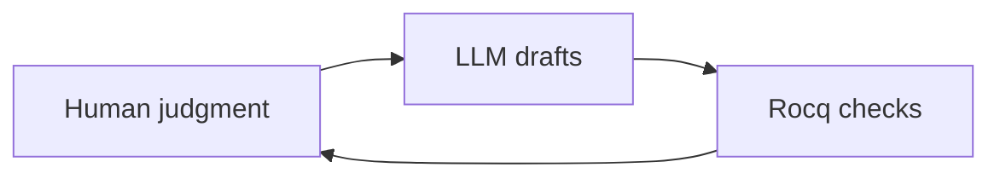

# AIPV review feedback → presentation prep note

This note maps **reviewer questions** about the extended abstract to **Slides**, **Poster**, **Private Q&A**, and **Other** (e.g. abstract revision). Use **N/A** when a channel carries nothing for that point. **Oral delivery follows Slides**; avoid reading long Poster text verbatim in the talk.

**Source abstract:** [`aipv2026_extended_abstract.tex`](./aipv2026_extended_abstract.tex)  
**Background plan:** [`aipv2026_plan.md`](./aipv2026_plan.md)

---

## Optional workflow figure (reuse on Slides and Poster)

| Channel   | Use |
|-----------|-----|
| **Slides** | One figure slide for the three-role loop. |
| **Poster** | Small workflow graphic in a corner. |
| **Private Q&A** | N/A |
| **Other** | N/A |

---

## 1. “What exactly does LLM breadth mean?”

**Avoid the word *breadth* on materials.** Pick one label project-wide: **cross-domain drafting**, **multi-field coverage**, or **cross-specialty linking**. Optional contrast: *The LLM suggests across fields; the proof assistant checks each step locally.*

| Channel | Content |
|---------|---------|
| **Where it shows up** | Abstract closing sentence (“human judgment, LLM breadth, and prover-backed certainty”); Introduction §3 (“distinct roles of human judgment, LLM breadth, and prover-backed certainty”); Inverted Workflow (“The LLM provided breadth across domains”). |
| **Slides** | Title + 1–2 bullets: chosen label + one example (e.g. definitions/lemmas from combinatorics and coding theory in one development). Do **not** say “breadth” without defining it; prefer never using it. |
| **Poster** | Same phrase as slides (one line in workflow / three-roles panel); optional mini contrast line. |
| **Private Q&A** | Not a claim about SOTA benchmarks or leaderboard strength; **workflow-only**: drafting under human steering, checker filters bad fits. |
| **Other** | **Abstract v2:** replace “LLM breadth” with e.g. *“cross-domain drafting by the LLM”* or *“LLM-proposed lemmas spanning several areas.”* |

---

## 2. “Definitions that type-check” — what does type-check mean in Rocq?

| Channel | Content |
|---------|---------|
| **Where it shows up** | Introduction: “Definitions that type-check reveal useful abstractions”. |
| **Slides** | (a) Like **strong static typing for mathematical objects**. (b) **Types can depend on values** (example: vectors of length \(n\) vs \(m\)); ill-formed definitions fail **before** you finish proofs. Optional: “Rocq checks definitions for internal consistency.” |
| **Poster** | N/A — or one short footnote under “Rocq”: “definitions checked for consistency.” |
| **Private Q&A** | “Type-check” = **well-formed terms in a logical calculus**, not only programming data types. Type-checking **does not guarantee** the math is “true” if **axioms** are wrong or misleading. |
| **Other** | N/A — unless abstract v2 softens to *“definitions accepted by the checker”* instead of raw “type-check.” |

---

## 3. “Failed proof obligations reveal missing assumptions” — wrong statements? weak automation?

| Channel | Content |
|---------|---------|
| **Where it shows up** | Introduction: “failed proof obligations reveal missing assumptions”. |
| **Slides** | **Softened claim:** failures are **diagnostic**; you often read them as missing lemmas or side conditions **after inspecting goals** — not that every failure is “missing assumptions.” One-line triage (spoken): wrong statement vs stuck automation vs missing hypothesis — **no** Rocq tactic jargon on the slide. |
| **Poster** | N/A — or one short line in a methodology corner matching the slides. |
| **Private Q&A** | How you **told them apart**: independent-looking subgoal → often missing lemma/assumption; goal **unchanged** after tactics → often automation; formal statement ≠ informal intent → **statement error**. Offer SMC-PGG examples only if asked. |
| **Other** | **Abstract v2:** e.g. obligations can *“signal”* missing lemmas or side conditions — not unconditional “reveal.” |

---

## 4. MPC / mathematics at high level in the talk; details offline or on poster

**Source for high-level MPC math (category-style notes, strip for talks):**  
`/Users/cheng-huiweng/Projects/aplas2024-poster/abstract-mpc/main.tex` (through ~line 492: correctness square, ambient views, partition lens). Use **prose and English-labeled figures only** in the workshop materials.

| Channel | Content |
|---------|---------|
| **Where it shows up** | Abstract + Case Study (dense: monodromy, RAAG, Cartier–Foata, Massey, collusion bound, etc.). |
| **Slides** | **≤2 slides:** (1) One-sentence MPC — parties compute a **function of private inputs** while controlling what leaks through the adversary’s **view**. (2) **Correctness in words:** inputs + randomness → per-party local pieces → **reconstruct** → equals ideal \(f(\text{inputs})\) (trusted-third-party output). Optional: **English-only** commuting-square diagram (no \(\mathbf{Set}_\kappa\), no unexplained \(\pi_S,\rho\) without one spoken gloss: “extra randomness”). One **spoken** line on security: corrupted parties see a **partial** transcript/view; analysis controls leakage. Then pivot: **“SMC-PGG is one case study — details on the poster.”** |
| **Poster** | **Layer stack:** protocol → search space → reconstruction → security — **without** large formulas. Optional **partition lens** mini-figure: observations lump executions into indistinguishability classes; more side information → **finer** partition; forgetting coordinates → **coarser**. English labels; line like “Ask about RAAG / Cartier–Foata / codes.” |
| **Private Q&A** | Full diagrammatic stack: masking/torsors, monoidal duals, coequalizers, master ambient diagram, Shamir example, TV/KL / Layer 1–2 detail — for specialists only. |
| **Other** | N/A — unless the workshop requests a **short written addendum** on MPC; then reuse only the one-sentence MPC + correctness line. |

---

## 5. “42 Rocq files” — how many lines of code?

**Repository reference (reconcile with “42” before publishing):** under `pgg-smc/` (infotheo-pgg workspace),

| Scope | `.v` files | Lines (approx.) |
|-------|------------|-----------------|
| All `pgg-smc/**/*.v` | 71 | ~24,700 |
| Excluding `denboer1989/` | 65 | ~23,400 |
| Also excluding `security/debug_morph.v`, `security/pgg_schreier_test.v` | 63 | ~23,300 |

The abstract’s **“42 files”** does not match this tree as-is — **define scope** or **update the count** so slides, poster, and abstract agree.

| Channel | Content |
|---------|---------|
| **Where it shows up** | Abstract; Introduction §3; Case Study closing. |
| **Slides** | **One stat + scope**, e.g. “~23k lines, **N** `.v` files in scope: [your definition]” or “order \(10^4\) lines of Rocq.” Footnote: “file count matches abstract scope.” |
| **Poster** | Small **stats box:** file count + LOC + **one line** what is in/out of the count. |
| **Private Q&A** | Why the abstract said 42 vs current repo; comments/blank lines; generated vs hand-written if asked. |
| **Other** | **Abstract v2:** add LOC and the **same** file-count definition as slides/poster. |

### Your scope definition (fill in)

- **Files included in “the formalization”:** *[FILL IN: glob or list]*  
- **Files excluded and why:** *[FILL IN]*  
- **Published file count N:** *[FILL IN]*  
- **Published LOC (approx.):** *[FILL IN]*

---

## 6. Quantitative: time on tasks and costs

| Channel | Content |
|---------|---------|
| **Where it shows up** | (Not in current abstract — reviewer asked for this.) |
| **Slides** | N/A — **or** one slide: small table (3–5 rows) of **approximate** hours or % + LLM cost line if comfortable; label **“retrospective estimate.”** |
| **Poster** | Same table in a compact **stats / effort** box. |
| **Private Q&A** | Per-phase memory (protocol / RAAG / AG codes / security). Tooling (RAM, `make -j1`, rocqworker) only if asked. |
| **Other** | N/A — unless proceedings need compute/support acknowledgment. |

### Time and cost (fill in)

| Task / phase | Approx. time | Notes |
|--------------|--------------|-------|
| Architecture / steering | *[FILL IN]* | |
| Proof iteration / LLM drafting | *[FILL IN]* | |
| Debugging (e.g. unification) | *[FILL IN]* | |
| Documentation / paper | *[FILL IN]* | |
| **LLM subscription or API** | *[FILL IN e.g. $/month or project total]* | |

---

## 7. “We” vs single author — collaborators, supervisors, LLM workflow

| Channel | Content |
|---------|---------|
| **Where it shows up** | Abstract and body use **“we”**; author line is single human. |
| **Slides** | Slide 1 or roles slide: **“I”** (human) + **“LLM assistant (Claude)”** as tool. If you say **“we”** once, define it as **author + assistant**, not human coauthors. If supervisors/students exist: one line — e.g. high-level feedback only; **not** in the LLM loop. |
| **Poster** | Same convention in author line / short workflow caption. |
| **Private Q&A** | Full authorship narrative: who did what; how LLM sessions were run. |
| **Other** | Acknowledgments / conflict statement for camera-ready. |

### Team and pronouns (fill in)

- **Human author:** Cheng-Hui Weng  
- **Use in talk:** “I” / “we (author + LLM)” — *[pick one]*  
- **Supervisors / students / colleagues:** *[FILL IN: names + role, or “none”]*  
- **Their role in LLM workflow:** *[FILL IN]*  

---

## 8. Accessible to non-Rocq audience — e.g. what `Admitted` means

| Channel | Content |
|---------|---------|
| **Where it shows up** | Inverted Workflow: “without `Admitted`”. |
| **Slides** | **Glossary slide** (4–6 terms): *proof assistant*; *machine-checked proof*; *axiom*; *placeholder proof* (plain language for `Admitted`); *definition is consistent*. Say aloud: **“no permanent proof holes”** instead of “0 Admitted” unless you define `Admitted` on this slide. |
| **Poster** | N/A — or **micro-glossary** (2–3 terms) in a corner. |
| **Private Q&A** | Exact `Admitted` syntax; why it is discouraged in finished libraries; relation to axioms. |
| **Other** | N/A |

---

## Consolidated optional abstract revisions (no `.tex` edit in this note)

Use these when you revise the PDF; keep wording consistent with Slides/Poster.

1. **Closing trio:** Replace “LLM breadth” with **cross-domain drafting** (or your chosen label).  
2. **Type-check:** Consider *“definitions accepted by the checker”* if “type-check” feels too jargon-heavy.  
3. **Failed obligations:** Consider *“can signal missing lemmas or side conditions”* instead of unconditional “reveal missing assumptions.”  
4. **Scale:** Add **approximate LOC** and a **one-line scope** for file count so it matches the repo (update **42** if needed).  
5. **Pronouns:** Align **we** with audience expectations (define **author + LLM** or switch to **I** in the PDF if preferred).

---

## Checklist before the venue

- [ ] Chosen label for “breadth” used consistently (slides + poster + revised abstract if any).  
- [ ] MPC: ≤2 concept slides; no deep RAAG/Cartier–Foata on the main talk path.  
- [ ] File count and LOC reconciled; stats box matches abstract.  
- [ ] Time/cost table filled or slides omit that slide (N/A).  
- [ ] Pronouns and acknowledgments finalized.  
- [ ] Glossary slide rehearsed; avoid unexplained `Admitted`.
